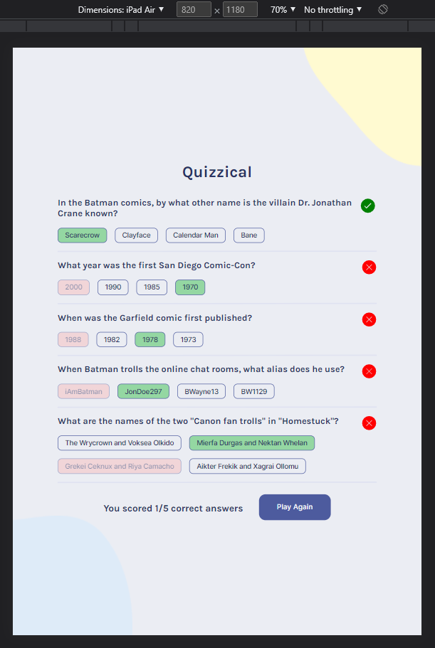

## Quizzical App

***Quiz WebApp that access trivia questions from the [Open Trivia Database API](https://opentdb.com/) and score players based on their answers. Multiple game options like difficulty and category are available for the player to change.***

***This is the final Solo Project of [Bob Ziroll's React Course on Scrimba](https://scrimba.com/learn/learnreact) developed from scratch by me.***

## ⚒️ Built with:
- HTML 5
- CSS 3
- JavaScript
- [React](https://reactjs.org/) - JS library

[Live App on Vecel](https://quizzical-react-quiz-app.vercel.app/)

[Live App on Netlify](https://quizzical-react-quiz-app.netlify.app/)

Quick start:

```
$ npm install
$ npm dev
$ npm build
```

## 📷 Screenshots:


<p align="center">
  
</p>

<p align="center">
  
</p>

<p align="center">
  
</p>
